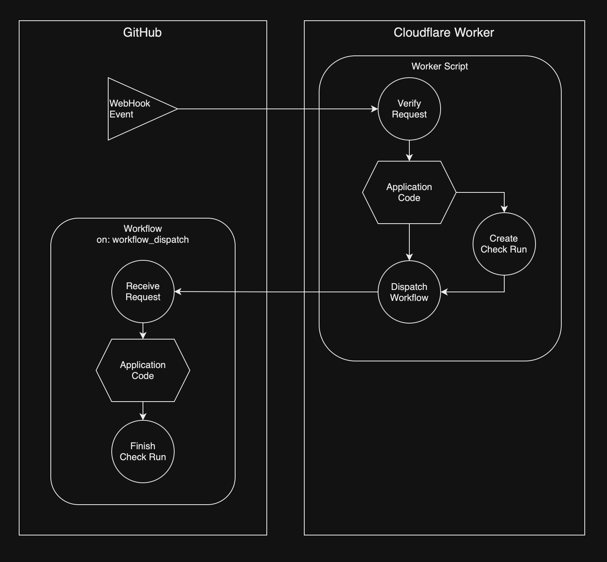

<!----- BEGIN GHOST DOCS HEADER ----->

# octoflare

<!----- BEGIN GHOST DOCS BADGES -----><a href="https://npmjs.com/package/octoflare"></a> <a href="https://npmjs.com/package/octoflare"></a> <a href="https://npmjs.com/package/octoflare"></a> <a href="https://npmjs.com/package/octoflare"></a> <a href="https://github.com/jill64/octoflare/actions/workflows/ci.yml"></a><!----- END GHOST DOCS BADGES ----->

🌤️ A framework for building GitHub Apps with Cloudflare Worker

<!----- END GHOST DOCS HEADER ----->

[Example Apps](https://github.com/jill64?tab=repositories&q=github-app&type=&language=&sort=stargazers)



## Start New Project with CLI

```sh
npm create octoflare
```

## Setup

The following must be set as environment variables for Cloudflare Workers

| Key                         | Value                                            | Reccomend Encryption | Auto Set by CLI |
| --------------------------- | ------------------------------------------------ | -------------------- | --------------- |
| OCTOFLARE_APP_ID            | GitHub App ID                                    |                      |                 |
| OCTOFLARE_PRIVATE_KEY_PKCS8 | GitHub App private key converted to PKCS8 format | ✔︎                   |                 |
| OCTOFLARE_WEBHOOK_SECRET    | GitHub App Webhook Secret                        | ✔︎                   |                 |
| OCTOFLARE_APP_REPO          | GitHub App Repository Name                       |                      | ✔︎              |
| OCTOFLARE_APP_OWNER         | GitHub App Repository Owner Name                 |                      | ✔︎              |

## Convert Privatekey

Before using the private key provided by GitHub, you need to convert it to PKCS8 format with the command below.

```sh
openssl pkcs8 -topk8 -inform PEM -outform PEM -nocrypt -in private-key.pem -out private-key-pkcs8.key
```

or Using [Web Tool](https://decoder.link/rsa_converter)

## Commands

| npm script             | Description                        |
| ---------------------- | ---------------------------------- |
| `npm run lint`         | Lint                               |
| `npm run format`       | Format by Prettier                 |
| `npm run build`        | Build worker script                |
| `npm run deploy`       | Deploy worker script to cloudflare |
| `npm run build:action` | Build GitHub javascript action     |

## Example

### Worker

```js
// src/index.js
import { octoflare } from 'octoflare'

export default octoflare(
  async ({ request, env, app, payload, installation }) => {
    // Application Code

    const { dispatchWorkflow } = await installation.createCheckRun({
      // ...
    })

    await dispatchWorkflow({
      // ...
    })

    return new Response('Workflow Dispatched', {
      status: 200
    })
  }
)
```

[Handler Type Definition](./src/types/OctoflareHandler.ts)

### Action

```js
// action/src/index.js
import { action } from 'octoflare'

action(({ request, env, app, payload }) => {
  // Application Code

  // Return Checks Status
  return {
    conclusion: 'success',
    output: {
      title: 'Check Success',
      summary: 'The check conclude as success'
    }
  }
})
```

<!----- BEGIN GHOST DOCS FOOTER ----->

## License

MIT

<!----- END GHOST DOCS FOOTER ----->
