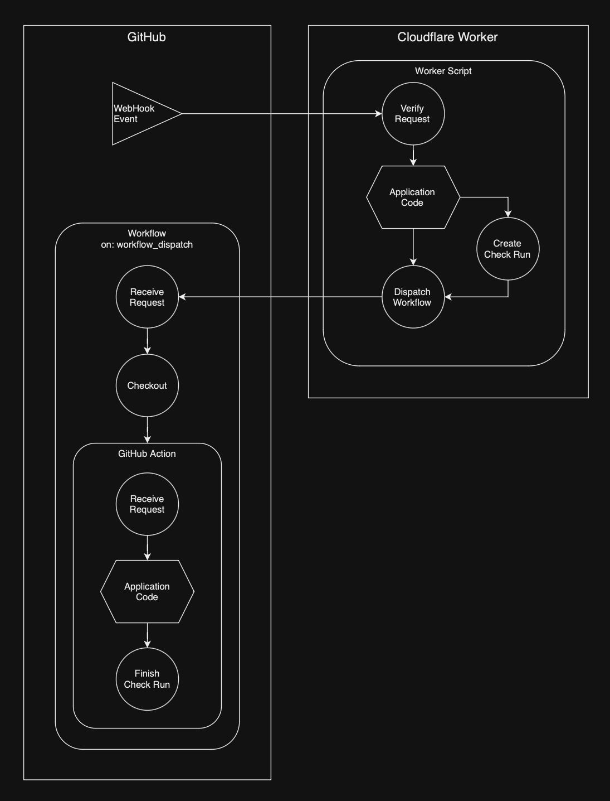

# Octoflare

[](https://npmjs.com/package/octoflare)

A framework for building GitHub Apps with Cloudflare Worker



## Installation

```sh
npm i octoflare
```

## Example

```js
// src/index.js
import { octoflare } from 'octoflare'

export default octoflare(
  async ({ request, env, app, payload, installation }) => {
    // Application Code

    const { dispatchWorkflow } = await installation.createCheckRun({
      // ...
    })

    await dispatchWorkflow({
      // ...
    })

    return new Response('Workflow Dispatched', {
      status: 200
    })
  }
)
```

```toml
# wrangler.toml
name = "YOUR_APP_NAME"
main = "src/index.js"
compatibility_date = "YYYY-MM-DD"
compatibility_flags = ["nodejs_compat"]

# ... Other Configs

```

The following must be set as environment variables for Cloudflare Workers

| Key                         | Value                                            |
| --------------------------- | ------------------------------------------------ |
| OCTOFLARE_APP_ID            | GitHub App ID                                    |
| OCTOFLARE_PRIVATE_KEY_PKCS8 | GitHub App private key converted to PKCS8 format |
| OCTOFLARE_WEBHOOK_SECRET    | GitHub App Webhook Secret                        |

[Handler Type Definition](./src/types/OctoflareHandler.ts)

## Convert Privatekey

Before using the private key provided by GitHub, you need to convert it to PKCS8 format with the command below.

```sh
openssl pkcs8 -topk8 -inform PEM -outform PEM -nocrypt -in private-key.pem -out private-key-pkcs8.key
```

## GitHub Action Example

```js
// action/src/index.js
import { action } from 'octoflare'

action(({ request, env, app, payload }) => {
  // Application Code

  // Return Checks Status
  return {
    conclusion: 'success',
    output: {
      title: 'Check Success',
      summary: 'The check conclude as success'
    }
  }
})
```

```yml
# action.yml
name: YOUR_ACTION_NAME
description: APPLICATION_DESCRIPTION

inputs:
  payload:
    description: Octoflare Payload
    required: true
  # ... any inputs

runs:
  using: node16
  main: action/dist/index.cjs
```

### Action Build

```sh
npm i -D esbuild
```

```js
// action/scripts/build.js
import { build } from 'esbuild'

build({
  entryPoints: ['action/src/index.ts'],
  bundle: true,
  platform: 'node',
  target: 'node16',
  outfile: 'action/dist/index.cjs'
})
```
